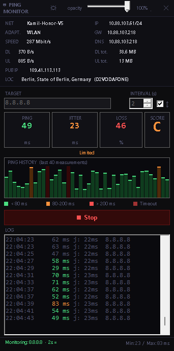

# 🏓 PingMonitor

A lightweight, always-on-top network monitoring widget for Windows, built entirely in PowerShell with WinForms.



## Features

- **Real-time ping monitoring** with configurable target and interval
- **Quality Score** (A/B/C/D/X) based on latency, jitter, and packet loss — calculated over a sliding window of the last 40 measurements
- **Dynamic interval (Auto mode)** — adjusts ping frequency based on network quality with hysteresis to prevent oscillation
- **Live network info** — adapter name, SSID, signal strength, IP, gateway, DNS
- **Bandwidth monitor** — real-time DL/UL speed and session totals
- **GeoIP lookup** — public IP, city, region, country, ISP (via ip-api.com)
- **Ping history chart** — color-coded bar chart (green < 80ms, orange 80–200ms, red > 200ms)
- **Color-coded log** with jitter values and debug info for timeout streaks
- **System tray icon** — shows current score grade with country flag badge; hover tooltip with score, ping, loss, and interval
- **Dark & Light theme** — toggle with one click
- **Adjustable opacity** — slider from 20% to 100%
- **Resizable & draggable** — borderless window with custom titlebar
- **Tooltips** — hover over any stat card, chart, or control for a quick explanation
- **DPI-aware tray icon** — renders at optimal resolution for your display scaling
- **Smart adapter detection** — skips VPN/virtual adapters to show your real physical connection
- **Connection loss detection** — score jumps to "X" after 5+ consecutive timeouts
- **Auto network change detection** — refreshes all info when switching Wi-Fi/Ethernet/VPN
- **Deferred startup** — window appears instantly, network data loads in background

## Requirements

- Windows 10 / 11
- PowerShell 5.1+ (pre-installed on Windows 10/11)
- No external dependencies, no admin rights required

## Installation

```powershell
git clone https://github.com/YOUR_USERNAME/PingMonitor.git
cd PingMonitor
```

## Usage

### Quick start

```powershell
powershell -ExecutionPolicy Bypass -File PingMonitor.ps1
```

Or simply double-click `Start-PingMonitor.bat` (hides the PowerShell console automatically).

### Create a desktop shortcut

Create a shortcut with target:

```
powershell.exe -ExecutionPolicy Bypass -WindowStyle Hidden -File "C:\path\to\PingMonitor.ps1"
```

> **Tip:** Add `-WindowStyle Hidden` to suppress the PowerShell console window.

### Autostart with Windows

1. Press `Win + R`, type `shell:startup`, press Enter
2. Place a shortcut to `PingMonitor.ps1` in the folder (see shortcut format above)

## Controls

| Control | Action |
|---|---|
| **TARGET** | IP or hostname to ping (default: `8.8.8.8`) |
| **INTERVAL** | Base seconds between pings (1–60, default: 2) |
| **↕ checkbox** | Enable/disable dynamic interval adjustment (Auto mode) |
| **▶ Start / ■ Stop** | Toggle monitoring |
| **☼ / ☽** | Switch between dark and light theme |
| **Opacity slider** | Adjust window transparency |
| **Titlebar drag** | Move the window |
| **Bottom edge / corner** | Resize the window |
| **Minimize** | Hides to system tray |
| **Tray double-click** | Restore from tray |
| **Tray right-click** | Show / Exit menu |

## Score Calculation

The quality score is based on the **last 40 measurements** (sliding window):

| Component | A (0 pts) | B (1 pt) | C (2–3 pts) | D (3+ pts) |
|---|---|---|---|---|
| **Avg latency** | < 50ms | 50–100ms | 100–200ms | > 200ms |
| **Jitter** | < 15ms | 15–40ms | 40–80ms | > 80ms |
| **Packet loss** | 0% | < 2% | 2–5% | > 5% |

**Total: A** (0–1) · **B** (2–3) · **C** (4–6) · **D** (7+) · **X** (5+ consecutive timeouts)

## Dynamic Interval (Auto Mode)

When the **↕** checkbox is enabled, the ping interval adjusts automatically based on network quality:

| Network State | Score | Interval | Rationale |
|---|---|---|---|
| **Stable** | A or B | 2× base | Network is fine, save resources |
| **Degraded** | C or D | 1× base | Normal monitoring |
| **Down** | X | 0.5× base (min 1s) | Fast polling to detect recovery |

The adjustment uses **hysteresis** — it waits for 5 consecutive readings at the same quality tier before changing the interval. This prevents the interval from oscillating rapidly when the network is borderline.

The current effective interval is shown in the status bar with an arrow indicator:
- `▲` = faster than base (network issues)
- `▼` = slower than base (network stable)
- `=` = at base interval

## Network Info Panel

| Field | Description |
|---|---|
| **NET** | SSID (Wi-Fi) or "LAN / Ethernet" |
| **ADAPT.** | Windows adapter name |
| **SPEED** | Link speed, with signal bars for Wi-Fi |
| **IP / GW / DNS** | Local IPv4 address, gateway, DNS servers |
| **DL / UL** | Current download/upload rate |
| **DL tot. / UL tot.** | Session download/upload totals |
| **PUB IP** | Public IP address (via ip-api.com) |
| **LOC** | City, region, country (ISP) |

## Tray Icon

The system tray icon shows:
- **Score letter** (A/B/C/D/X/?) in the corresponding color
- **Country flag badge** (bottom-right corner) based on GeoIP lookup
- **Hover tooltip** with score, current ping, loss percentage, and current interval (with ↕ indicator when Auto mode is active)

The icon renders at DPI-aware resolution (2× system icon size) for crisp display on high-DPI monitors.

## Tooltips

Hover over any key element for a quick explanation:

| Element | Tooltip |
|---|---|
| **PING card** | Round-trip time to target in milliseconds |
| **JITTER card** | Variation between consecutive pings — lower is more stable |
| **LOSS card** | Packet loss percentage over the last 40 measurements |
| **SCORE card** | Connection quality: A (excellent) to D (poor), X = no connection |
| **↕ checkbox** | Auto-adjust ping interval based on network quality |
| **Chart** | Ping history — last 40 measurements |
| **Net panel** | Network adapter info — refreshes every 15 seconds |

## Architecture

The entire application is a single PowerShell script with no external dependencies:

- **Async pings** via `System.Net.NetworkInformation.Ping.SendAsync()` — no threads, no UI freezes
- **WinForms UI** with custom-drawn borderless window
- **Deferred startup** — window appears instantly; heavy network lookups run 300ms after via one-shot timer
- **Timer-based updates** — bandwidth (2s), network info (15s), network change detection (5s)
- **Cached adapter lookup** — physical adapter route is cached for 10s to avoid expensive cmdlet calls on the UI thread
- **GeoIP via background job** — `Start-Job` runs the HTTP request off the UI thread, with auto-retry on failure
- **Debounced network refresh** — prevents cascading heavy lookups when multiple NetworkChanged events fire in quick succession

## Supported Country Flags

The tray icon shows flag stripes for 40+ countries including: 🇩🇪 DE, 🇵🇱 PL, 🇺🇸 US, 🇬🇧 GB, 🇫🇷 FR, 🇳🇱 NL, 🇮🇹 IT, 🇪🇸 ES, 🇦🇹 AT, 🇨🇭 CH, 🇸🇪 SE, 🇳🇴 NO, 🇩🇰 DK, 🇫🇮 FI, 🇧🇪 BE, 🇨🇿 CZ, 🇭🇺 HU, 🇷🇴 RO, 🇧🇬 BG, 🇵🇹 PT, 🇮🇪 IE, 🇷🇺 RU, 🇺🇦 UA, 🇯🇵 JP, 🇰🇷 KR, 🇨🇳 CN, 🇮🇳 IN, 🇦🇺 AU, 🇧🇷 BR, 🇨🇦 CA, 🇲🇽 MX, 🇹🇷 TR, 🇬🇷 GR, 🇭🇷 HR, 🇸🇰 SK, 🇸🇮 SI, 🇱🇹 LT, 🇱🇻 LV, 🇪🇪 EE, 🇱🇺 LU, 🇮🇱 IL, 🇿🇦 ZA, 🇦🇷 AR, 🇹🇭 TH, 🇸🇬 SG, 🇳🇿 NZ.

Unknown country codes show the score letter without a flag.

## License

MIT License — see [LICENSE](LICENSE) for details.
